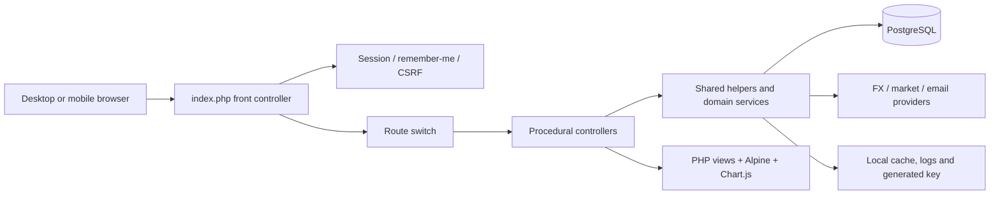
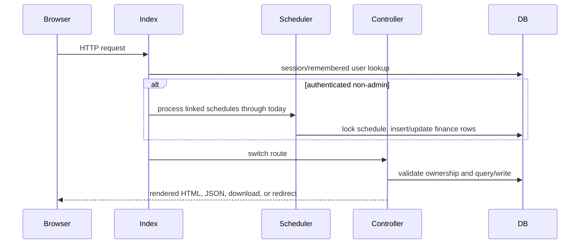
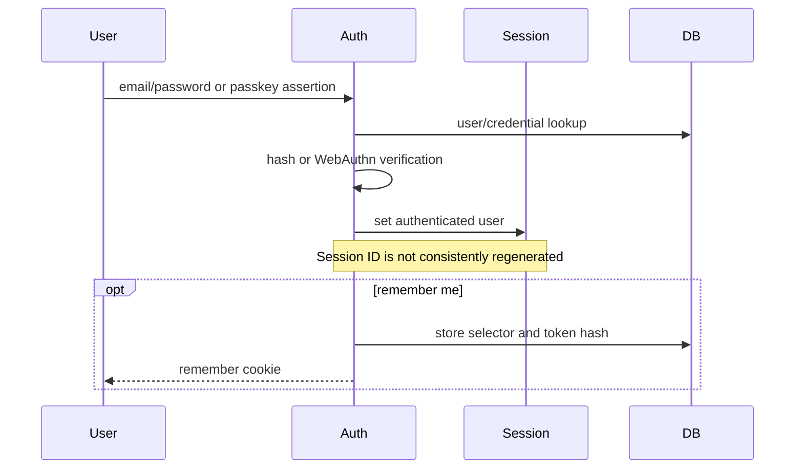
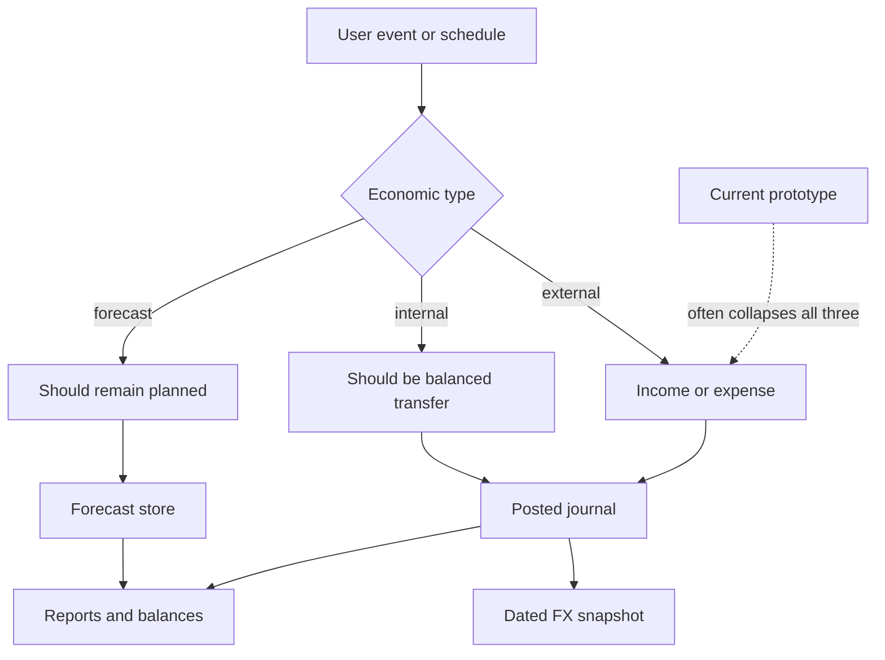
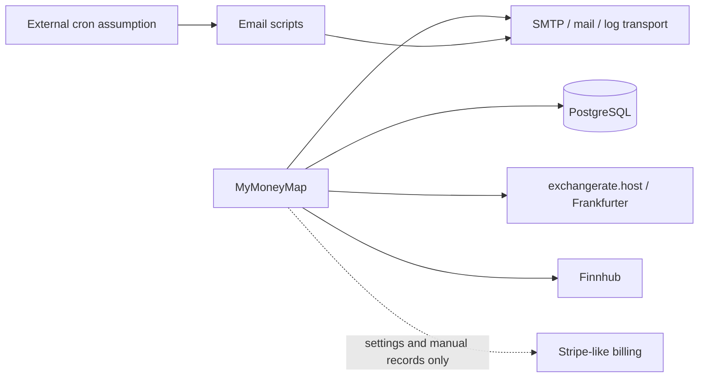

# MyMoneyMap — Complete Project Documentation

**Audit date:** 2026-07-29  
**Scope:** repository source, views, migrations, documentation, brand assets, and the configured local PostgreSQL schema  
**Evidence standard:** statements are based on code or schema unless explicitly marked as an inference. Secrets were not copied into this document.

## 1. Executive summary

MyMoneyMap is a server-rendered personal-finance web application. It combines monthly income and spending, configurable cash-flow rules, recurring payments, goals, loans, an emergency fund, generic investments, a separate stock-portfolio subsystem, multilingual email content, feedback, and an extensive administration area.

The product is a substantial prototype, not a production-ready financial SaaS. The repository contains approximately 39,000 lines of PHP, templates, JavaScript, CSS, and SQL, but it has no dependency manifest, automated build, deployment definition, CI pipeline, conventional test framework, queue, worker, or production observability. It is a procedural PHP modular monolith whose application entry point contains a large route switch and whose views contain considerable business/UI logic.

The most serious blockers are:

1. A migration installs or resets a predictable default administrator account.
2. Configuration contains weak hard-coded secret fallbacks.
3. Important finance flows treat movements between a user's own financial buckets as income or spending, distorting cash flow.
4. Stock selling can exceed available holdings, while proceeds are still calculated on the full sale.
5. Marketing and privacy copy claim encryption, exports, payment functionality, and product behavior that the implementation does not provide.

The correct product classification is **prototype / internal alpha**. It is useful for validating workflows and UI direction but should not be exposed to real customers or real financial data before the P0 remediation program in the roadmap.

## 2. Product purpose and audience

### Intended purpose

MyMoneyMap aims to give an individual a single map of day-to-day personal finances:

- record income and spending;
- view a calendar-month ledger;
- establish recurring income and obligations;
- allocate income using percentage-based cash-flow rules;
- track savings goals and an emergency reserve;
- project and record loan repayment;
- track savings/investment balances;
- track a stock portfolio, lots, realized profit/loss, quotes, and signals;
- receive periodic and event-based emails;
- manage account, currencies, theme, privacy, and passkeys.

### Intended users

- **Guest:** sees the landing page, registration, login, email verification, privacy page, and passkey-login flow.
- **Free user:** personal-finance application with quotas defined in `config/plans.php`.
- **Premium user:** higher/unlimited feature allowances and cash-flow editing.
- **Administrator:** separate operational console. The router deliberately prevents administrators from using the normal personal-finance pages.

The application has role-management screens and a `roles` table, but the database constraint on `users.role` still permits only `free`, `premium`, and `admin`. Arbitrary roles created in the administration UI cannot be safely assigned. Custom roles are therefore an incomplete feature, not a real RBAC system.

## 3. Current architecture

```text
Browser / installable PWA shell
  ├─ server-rendered PHP views
  ├─ Alpine.js interaction
  ├─ Tailwind CDN/JIT styling
  └─ Chart.js charts
          │
          ▼
index.php front controller and route switch
  ├─ procedural controllers in controllers/
  ├─ shared helpers in includes/
  ├─ stock domain services in src/Stocks/
  ├─ authentication, WebAuthn, FX and email helpers
  └─ request-bound scheduled-payment processing
          │
          ▼
PDO / PostgreSQL
  ├─ user finance and settings
  ├─ global currencies, FX and stock reference data
  ├─ billing/admin records
  └─ file-backed caches and logs beside the application
```

### Runtime

- PHP 8.1+ is documented; the audit linted the source successfully using PHP 8.4.7.
- PostgreSQL 13+ is documented and accessed through PDO.
- Sessions are native PHP sessions configured in `index.php`.
- There is no Composer package manifest and no external PHP framework.
- Routes are declared as `case` branches in `index.php`.
- Controllers are collections of global procedural functions.
- Views mix HTML, PHP, inline JavaScript, inline CSS, Tailwind directives, and business-specific presentation logic.
- The stock subsystem is the clearest domain module: provider, portfolio, chart, signal, and trade classes live in `src/Stocks`.

### Client-side stack

- Tailwind is loaded from a public CDN and compiles page-embedded Tailwind styles at runtime.
- Alpine.js provides lightweight client interactions.
- Chart.js renders charts.
- IBM Plex Sans is fetched from Google Fonts.
- The application theme system creates CSS variables for eight palettes, supports light/dark appearance, and persists a user theme.
- A dynamic web manifest supports standalone presentation, portrait orientation, icons, and theme colors.
- There is no service worker, offline cache, background sync, push implementation, or install/update lifecycle. The current “PWA” is only an installable shell.

### Coupling and request lifecycle

The authenticated request lifecycle is unusually broad. On almost every non-admin request, `index.php` calls linked scheduled-payment processing before dispatching the requested page. This means navigation can lock rows, perform calculations, insert transactions, and call FX services. Background work is coupled to page latency and availability.

Business boundaries are also porous:

- goal, emergency-fund, investment, loan, and scheduled-payment actions can create or mutate general transactions;
- reports rebuild historical FX values during reads;
- the loans list may backfill and write payment breakdowns during a GET;
- stock trades update positions, lots, realized profit/loss, cash movements, and cache files;
- several totals are stored both as a ledger and a denormalized balance.

These relationships are valuable product behavior, but they require explicit domain services, idempotency, transactional tests, and an auditable double-entry or event-ledger model.

## 4. Repository inventory

| Area | Purpose | Principal evidence |
|---|---|---|
| `index.php` | bootstrap, session, authentication restoration, route dispatch | all application routes |
| `config/` | app, DB, themes, locales, plans, stock provider | `config.php`, `db.php`, `themes.php`, `plans.php`, `stocks.php` |
| `controllers/` | procedural application and admin use cases | transactions, goals, loans, emergency, stocks, settings, admin |
| `includes/` | auth, CSRF, encryption, email, FX, scheduling, WebAuthn, shared helpers | cross-cutting services |
| `views/` | landing, auth, finance, settings, stocks, admin, email previews | server-rendered UI |
| `src/Stocks/` | class-based stock provider and portfolio domain | adapters and services |
| `migrations/` | PostgreSQL schema evolution and seeds | migrations `001`–`036` |
| `lang/` | English, Hungarian, Spanish, and unused Greek strings | localization |
| `public/` | CSS, theme script, icons and manifest support | browser assets |
| `docs/email_templates/` | reference email templates in three languages | communication design |
| `scripts/` | migration/email helper scripts | operational utilities |
| `tests/` | one database-backed stock service script | limited regression evidence |
| `storage/` | generated encryption key, cache/log destinations at runtime | instance-local state |

Not found: `composer.json`, `package.json`, Dockerfile, container orchestration, CI workflow, PHPUnit/Pest configuration, Tailwind build configuration, infrastructure-as-code, OpenAPI specification, health checks, queue configuration, backup/restore procedure, or rollback runbook.

## 5. Navigation and mobile information architecture

### Desktop navigation

Authenticated non-admin users receive primary navigation for the dashboard/month context and the major finance areas. Settings and less-frequent features are accessible through secondary navigation. Administrators receive a separate console.

### Mobile navigation

At widths below the medium breakpoint, the desktop header is hidden and a fixed bottom bar becomes the primary navigation:

- Dashboard
- Months
- Goals
- More

`More` exposes loans, emergency fund, scheduled payments, investments, settings, and other secondary areas. This is a sensible starting hierarchy, but important money workflows are two levels deep. Stock tracking, loans, emergency savings, and investments compete inside the catch-all destination.

The admin mobile navigation has nine horizontally scrolling entries. That is discoverable only by swiping and is not a robust administration information architecture.

### Responsive behavior observed in source

- Modals commonly become full-screen/`100vh` on mobile.
- Data-heavy tables usually become horizontally scrollable rather than transform into cards or prioritized rows.
- Content uses responsive grids and spacing in many views, but there is no documented breakpoint or component contract.
- Landscape mode on devices up to 960 px is blocked by a full-screen rotate-device overlay.
- The viewport disables user zoom, and JavaScript suppresses pinch and double-tap zoom.
- The PWA manifest forces portrait orientation.

Consequently, the application is **responsive in layout but not mobile-complete**. It is particularly weak for accessibility, landscape use, dense tables, and one-handed execution of frequent actions. Disabling zoom is a direct accessibility failure.

### Recommended mobile IA

Use five stable destinations: **Home, Activity, Plan, Grow, More**.

- **Home:** current cash position, urgent actions, month progress.
- **Activity:** unified ledger, search, filters, add action.
- **Plan:** budget/cash-flow rules, bills, goals, loans, emergency fund.
- **Grow:** investments and securities portfolio.
- **More:** reports, exports, preferences, privacy, support.

Expose a persistent “Add” action that branches to income, expense, transfer, bill, contribution, trade, and adjustment. Do not hide the core ledger behind “Months,” and do not treat internal transfers as income or spending.

## 6. Route and page inventory

The method guard and controller provide the effective API contract. HTML routes generally return a rendered page or a redirect with a session flash; `/api/stocks/live` and WebAuthn endpoints return JSON; privacy export returns a JSON download. Unless stated otherwise, authenticated write routes require CSRF through their controller. Input failures mostly redirect with a flash message; PDO and external-service failures are inconsistently caught.

### Public and authentication

| Route | Method / access | Function and main input/output |
|---|---|---|
| `/` | GET, public or authenticated | landing page for guests; dashboard for users; admin redirect/console behavior |
| `/register` | GET/POST, guest | multi-step registration; email/password/profile input; creates user and session |
| `/verify-email` | GET/POST, public/session | token verification or resend; marks email verified |
| `/login` | GET/POST, guest | password authentication and optional remember-me |
| `/logout` | GET/POST, authenticated | destroys session and remember token; GET support permits logout CSRF |
| `/privacy` | GET, public | privacy policy |
| `/webauthn/options/register` | POST JSON, authenticated | returns passkey creation options |
| `/webauthn/register` | POST JSON, authenticated | validates attestation and stores credential |
| `/webauthn/options/login` | POST JSON, guest | returns assertion options |
| `/webauthn/login` | POST JSON, guest | validates assertion and starts login session |

There are links to `/demo`, `/terms`, `/contact`, and `/about`, but no corresponding route.

### Onboarding and tutorial

| Routes | Access | Behavior |
|---|---|---|
| `/onboard/next`, `/onboard/theme`, `/onboard/rules`, `/onboard/currencies`, `/onboard/income`, `/onboard/categories`, `/onboard/done` | authenticated onboarding user | progresses a persisted onboarding sequence |
| `/onboard/currencies/add`, `/onboard/currencies/delete` | POST | modifies user currency selection |
| `/onboard/income/delete` | POST | removes base income |
| `/onboard/categories/add`, `/onboard/categories/delete` | POST | manages initial categories |
| `/tutorial`, `/tutorial/done` | authenticated | displays and completes post-onboarding tutorial |

### Transactions, months, and years

| Routes | Access | Behavior and data |
|---|---|---|
| `/current-month` | authenticated | current-month ledger/calendar, totals, basic incomes and virtual entries |
| `/transactions/add`, `/transactions/edit`, `/transactions/delete` | POST | CRUD on `transactions`; amount, kind, date, currency, category, note |
| `/years` | authenticated | year/month aggregation |
| `/months/tx/add`, `/months/tx/edit`, `/months/tx/delete` | POST | month-context aliases for transaction CRUD |
| `/months/tx/list` | GET, authenticated | paginated/filtered transaction fragment/list |

The ledger has no account dimension, transfer kind, reconciliation state, statement import, or duplicate detection. Amounts are expected to be positive by convention, but the controller does not enforce that convention consistently.

### User settings

| Routes | Purpose |
|---|---|
| `/settings` | settings hub |
| `/settings/privacy`, `/settings/privacy/export`, `/settings/privacy/delete` | privacy page, JSON export, account deletion |
| `/settings/profile`, `/settings/profile/password` | identity and password changes |
| `/settings/passkeys/delete` | remove passkey |
| `/settings/theme` | appearance/theme |
| `/settings/currencies`, `/add`, `/remove`, `/main` | currency membership and main currency |
| `/settings/basic-incomes`, `/add`, `/edit`, `/delete` | recurring baseline income |
| `/settings/categories`, `/add`, `/edit`, `/delete` | income/spending categories |
| `/settings/cashflow`, `/add`, `/edit`, `/delete`, `/assign` | percentage rules and category mapping |

The app enforces one main currency in application code, not through a database uniqueness constraint. Setting an invalid main currency can leave none selected, after which helpers fall back to HUF.

For avoidance of ambiguity, the abbreviated settings rows above expand to these exact write paths: `/settings/currencies/add`, `/settings/currencies/remove`, `/settings/currencies/main`, `/settings/basic-incomes/add`, `/settings/basic-incomes/edit`, `/settings/basic-incomes/delete`, `/settings/categories/add`, `/settings/categories/edit`, `/settings/categories/delete`, `/settings/cashflow/add`, `/settings/cashflow/edit`, `/settings/cashflow/delete`, and `/settings/cashflow/assign`.

### Goals

| Routes | Behavior |
|---|---|
| `/goals` | list progress, contribution history, schedules |
| `/goals/add`, `/goals/edit`, `/goals/delete` | goal CRUD |
| `/goals/archive`, `/goals/unarchive` | archive lifecycle and linked payout transaction |
| `/goals/create-schedule`, `/goals/link-schedule`, `/goals/unlink-schedule` | recurring contribution linkage |
| `/goals/tx/add`, `/goals/tx/update`, `/goals/tx/delete` | contribution ledger |

Archiving a goal catches up linked contributions and records the entire saved amount as income. That is an internal transfer and materially overstates income. A goal is locked only when archived; a completed but unarchived goal can still receive contributions.

### Loans

| Routes | Behavior |
|---|---|
| `/loans` | balances, estimated progress, amortization, history |
| `/loans/add`, `/loans/edit`, `/loans/archive`, `/loans/delete` | loan lifecycle |
| `/loans/payment/add`, `/loans/payment/update`, `/loans/payment/delete` | payment ledger and balance mutation |
| `/loals/unlink-schedule` | schedule unlink; route contains the misspelling `loals` |

The model uses a nominal annual rate divided by 12 and the standard fixed-payment annuity formula. It does not model lender-specific APR, fees, daily accrual, payment timing, variable rates, delinquency, or statutory rounding. Manual cross-currency payments subtract principal without conversion; scheduled payments do convert. The list page can also mutate old payment records by estimating missing breakdowns during a GET.

### Scheduled payments

| Routes | Behavior |
|---|---|
| `/scheduled` | recurring item list and projections |
| `/scheduled/add`, `/scheduled/edit`, `/scheduled/delete` | recurring item CRUD |

The recurrence parser supports a subset of RRULE: daily, weekly, monthly, yearly, interval, `BYDAY`, `BYMONTHDAY`, `BYMONTH`, `COUNT`, and `UNTIL`. It is not a complete RFC 5545 engine. Processing uses row locks and transactions, but runs synchronously during normal authenticated page requests. Unlinked schedules are projections only and scheduled items are always treated as spending.

### Emergency fund

| Routes | Behavior |
|---|---|
| `/emergency` | reserve total, target suggestions, history, linked investment |
| `/emergency/target` | update target |
| `/emergency/add`, `/emergency/withdraw` | adjust reserve and create general ledger entry |
| `/emergency/tx/delete` | reverse an adjustment |

Deposits are recorded as spending and withdrawals as income. Those are transfers between a user's own buckets, not economic spending/income. Target guidance derives “needs” from all scheduled payments in the next month, including goals and investments, then advances through fixed milestones. It should be labeled as configurable educational guidance, not personalized financial advice.

### Generic investments

| Routes | Behavior |
|---|---|
| `/investments` | balance, ledger, accrued-interest estimate, projections |
| `/investments/add`, `/investments/update`, `/investments/delete` | investment lifecycle |
| `/investments/adjust` | deposit/withdrawal |
| `/investments/scheduled/create` | link a recurring contribution |

This subsystem treats savings, ETFs, and stocks as balance accounts with a fixed annual interest assumption. That can be useful for deterministic scenarios but is not a valid expected-return model for market securities without a clear scenario disclaimer. It is separate from the stock portfolio and has no reconciliation between the two.

### Stocks

| Route | Purpose |
|---|---|
| `/stocks` | portfolio overview, allocation and watchlist |
| `/stocks/transactions` | trade and cash history |
| `/stocks/trade` | record buy/sell |
| `/stocks/import` | broker CSV import |
| `/stocks/cash` | add signed cash movement |
| `/stocks/refresh` | refresh quotes/history |
| `/stocks/clear` | clear user stock history |
| `/stocks/trade/delete` | delete trade and rebuild |
| `/api/stocks/live` | JSON live-quote response |

The subsystem uses FIFO lots and allocates fees into realized profit/loss. It also builds positions and cached portfolio views. Key gaps are oversell validation, irreversible cash drift when one trade is deleted, exchange-symbol collisions, corporate actions, dividends linked to securities, tax rules, provider delay/rate-limit handling, and accurate historical base-currency attribution.

### Feedback and “More”

| Route | Purpose |
|---|---|
| `/more` | mobile/secondary navigation hub |
| `/feedback` | user feedback page |
| `/feedback/add`, `/feedback/status`, `/feedback/delete` | feedback lifecycle |

### Administration

| Route family | Purpose |
|---|---|
| `/admin`, `/admin/analytics` | dashboard and operational analytics |
| `/admin/system`, `/admin/system/settings` | system configuration |
| `/admin/system/api/save`, `/delete` | encrypted external API credentials |
| `/admin/system/email/save`, `/test` | email transport configuration and test |
| `/admin/system/notifications/save`, `/add` | channel configuration |
| `/admin/emails`, `/preview` | multilingual email template editor/preview |
| `/admin/users`, `/manage`, `/role`, `/reset-password`, `/resend-verification`, `/reset-email`, `/status` | user administration |
| `/admin/users/invoices/update`, `/payments/create`, `/payments/update` | manual billing records |
| `/admin/users/feedback/update`, `/respond` | feedback operations |
| `/admin/billing` | billing dashboard |
| `/admin/billing/plans/create`, `/edit`, `/plans`, `/plans/update`, `/plans/delete` | plan CRUD |
| `/admin/billing/promotions/create`, `/edit`, `/promotions`, `/promotions/update`, `/promotions/delete`, `/promotions/generate-trial` | promotion CRUD |
| `/admin/billing/settings`, `/admin/billing/user-plan` | provider settings and manual subscription assignment |
| `/admin/roles`, `/create`, `/edit`, `/update`, `/delete` | incomplete custom role management |
| `/maintenance/migrations`, `/admin/migrations` | admin migration runner |

Every inspected admin controller function invokes the admin guard. However, financial permissions are not granular RBAC; billing is an administrative ledger rather than an end-user checkout/subscription system; and provider secrets are displayed and stored in unsafe ways.

The exact administration write/read paths abbreviated in that table are:

- system and email: `/admin/system/api/delete`, `/admin/system/email/test`, `/admin/system/notifications/add`, `/admin/emails/preview`;
- feedback and users: `/admin/feedbacks`, `/admin/users/manage`, `/admin/users/role`, `/admin/users/reset-password`, `/admin/users/resend-verification`, `/admin/users/reset-email`, `/admin/users/status`, `/admin/users/payments/create`, `/admin/users/payments/update`, and `/admin/users/feedback/respond`;
- plans: `/admin/billing/plans/edit`, `/admin/billing/plans`, `/admin/billing/plans/update`, and `/admin/billing/plans/delete`;
- promotions: `/admin/billing/promotions/edit`, `/admin/billing/promotions`, `/admin/billing/promotions/update`, `/admin/billing/promotions/delete`, and `/admin/billing/promotions/generate-trial`;
- roles: `/admin/roles/create`, `/admin/roles/edit`, `/admin/roles/update`, and `/admin/roles/delete`.

## 7. Data model

### High-level entity map

```text
users
 ├─ user_remember_tokens / user_passkeys / user_login_activity
 ├─ user_currencies ── currencies ── fx_rates
 ├─ categories ── cashflow_rules
 ├─ transactions / basic_incomes / scheduled_payments
 ├─ goals ── goal_contributions
 ├─ loans ── loan_payments
 ├─ emergency_fund ── emergency_fund_tx
 ├─ investments ── investment_transactions
 ├─ stock_trades ── stock_lots / stock_positions / stock_realized_pl
 │                    └─ stocks ── price and quote tables
 ├─ feedback ── feedback_responses
 └─ subscriptions / invoices / payments

system_settings / roles / billing_plans / promotions / billing_settings
email_templates / notification_channels / api_integrations
```

### Data dictionary

| Domain | Tables / view | Key attributes and constraints | Audit notes |
|---|---|---|---|
| Identity | `users` | email, password hash, encrypted name, role, verification/onboarding/status fields | role check is fixed to free/premium/admin; verification is not an access gate |
| Sessions | `user_remember_tokens`, `user_passkeys`, `user_login_activity` | selectors/token hashes, credential IDs/public keys/counters, activity metadata | passkey material is normally public but should not be described as user-private-key encryption |
| Currency | `currencies`, `user_currencies`, `fx_rates`, `v_fx_latest` | codes/rates/date; user main flag | no DB guarantee of exactly one main currency; source metadata absent |
| Ledger | `transactions`, `basic_incomes`, `categories`, `cashflow_rules` | amount/date/kind/currency/category/rule | amount sign and ownership invariants are weak; no account/transfer model |
| Scheduling | `scheduled_payments` | recurrence, next due, optional links | request-bound execution; all schedules are spending |
| Goals | `goals`, `goal_contributions`, legacy `goal_transactions` | target/current/status/category and contribution ledger | legacy duplicate table; balance is denormalized |
| Loans | `loans`, `loan_payments` | principal/balance/rate/term/payment details | model is a simplified estimate, not a lender-grade amortization engine |
| Emergency | `emergency_fund`, `emergency_fund_tx`, legacy `emergency_transactions` | target/total and adjustment ledger | current total is denormalized; one transaction table lacks an ownership FK |
| Investments | `investments`, `investment_transactions` | type, balance, nominal rate, frequency | local DB has untracked `stock_id` and `units` columns |
| Stock reference | `stocks`, `stock_prices_last`, `price_daily` | symbol/market/metadata/quotes | some code looks up symbol without market |
| Stock user data | `stock_trades`, `stock_lots`, `stock_positions`, `stock_realized_pl`, `stock_cash_movements`, `stock_portfolio_snapshots`, `watchlist`, `user_settings_stocks` | quantity, price, fees, lots, positions, P/L, cash | no trade-linked cash reversal; shared stock delete cascades trades |
| Billing | `billing_plans`, `billing_promotions`, `billing_settings`, `user_subscriptions`, `user_invoices`, `user_payments` | plan/provider/ledger/status | manual administration only; secrets stored plaintext |
| Operations | `system_settings`, `api_integrations`, `email_templates`, `notification_channels`, `roles`, `schema_migrations` | configuration and content | external API values use application encryption; custom roles conflict with DB constraint |
| Feedback | `feedback`, `feedback_responses` | severity/status/content/resolution | operational feature, not a full ticketing/audit system |
| Learning | `baby_steps` | step/progress data | table exists without an active product route/controller |

Most financial values are PostgreSQL `NUMERIC`, but application code frequently casts them to PHP `float`. That loses the principal benefit of decimal storage and risks rounding drift. A fixed two-decimal presentation is also unsuitable for zero-decimal currencies, three-decimal currencies, FX rates, and security quantities.

### Referential-integrity observations

- Early/core tables allow nullable `user_id` values more often than a tenant system should.
- Some ownership columns, including emergency and legacy goal transaction tables, lack a proper FK.
- Relationships generally use an object ID plus a separately filtered user ID rather than a composite tenant key.
- A shared stock row can cascade-delete user trades.
- Core amount fields lack domain checks such as `amount > 0`.
- Duplicate transaction indexes exist while several common user/date/status paths are under-indexed.
- There is no row-level security.

### Migration state

Migrations use a custom runner and filename ordering. Duplicate numeric prefixes exist, increasing ordering ambiguity. In the configured local database:

- recorded migrations end at `035`;
- `036_goal_category.sql` is not recorded as applied, although the corresponding goal category column is present;
- `investments.stock_id` and `investments.units` exist but are not created by any repository migration.

This is concrete schema drift. A clean migration rehearsal cannot be assumed to reproduce the inspected database.

## 8. Business and financial logic

### Transaction semantics

Income and spending are stored as positive amounts with direction derived from `kind`. The UI/controllers do not uniformly reject zero or negative values. There are no accounts, opening balances, cleared/pending states, transfers, splits, payees, statement reconciliation, or import idempotency.

Month pages add “virtual” rows for basic incomes, scheduled bills, investment adjustments, and goal contributions. Some linked schedules are materialized as real transactions while other schedules remain projections. This makes the distinction between forecast, planned, and posted activity hard for users and developers to reason about.

### Cash-flow rules

A rule assigns a percentage of monthly income to categories. Each rule is validated between 0% and 100%, but the aggregate is not constrained to 100%. The displayed per-category cap evenly divides a rule's budget among assigned categories, which is a presentation assumption rather than a user-authored budget. Remaining values clamp at zero, hiding the amount of overspend.

### Foreign exchange

Conversion uses EUR as a pivot:

`amount in target = amount / EUR-to-source × EUR-to-target`

That formula is sound if both rates match the intended date. The implementation first uses cached rates and then external providers. If a rate is unavailable, it silently returns the original numeric amount while callers present it as the target currency. This is a severe correctness failure.

The cache does not preserve provider, retrieval timestamp, or rate quality. Future month rates are prefetched by copying a current rate onto future dates, which makes later “historical” calculations look dated and reproducible when they are not. Ordinary transaction writes do not populate all available FX snapshot columns, so reports can change when the rate store changes.

### Loans

The standard payment estimate is:

`payment = P × r × (1+r)^n / ((1+r)^n − 1)`

where `r` is the annual nominal percentage divided by 12 and `n` is the number of months. Zero-rate handling is included. This is mathematically appropriate for a simple fixed nominal-rate illustration.

It is not APR, effective annual rate, or lender-grade repayment logic. It ignores day-count conventions, irregular first periods, exact payment timestamps, fees, variable rates, holidays, arrears, and contractual rounding. Manual cross-currency payments and scheduled payments apply different conversion behavior. “Confirmed history” may synthesize expected payments and blend them with actual ledger values. These results must be labeled estimates and reconciled to lender statements.

### Goals and emergency fund

Both use a ledger plus a denormalized current total. Contributions and withdrawals can also create main-ledger transactions. The present categorization is economically wrong:

- moving money into an emergency reserve is classified as spending;
- withdrawing reserve money is classified as income;
- archiving a completed goal creates income equal to its full balance.

These are transfers between owned buckets. They should not affect income, spending, or savings-rate metrics unless a subsequent external purchase is recorded separately.

### Investments

The generic investment projection compounds a nominal annual rate at a chosen frequency, including fractional periods. It is suitable only as a scenario calculator. Applying a fixed “interest rate” to ETF/stock types is not a forecast based on market data. The current stored balance does not automatically include calculated accrued interest, and the separate stock subsystem has no accounting bridge to this balance.

### Stock portfolio

FIFO lot consumption and fee allocation are reasonable foundations. However:

- a sale larger than the available position is accepted;
- lot consumption stops at available quantity, but cash proceeds use the full entered quantity;
- deleting one trade rebuilds positions/lots but does not reverse its cash movement;
- base-currency unrealized P/L converts cost at today's FX, not acquisition-date FX;
- missing quotes fall back to average cost and appear as zero unrealized movement instead of “valuation unavailable”;
- historical charts include calendar days without robust market-day forward filling;
- provider metadata maps an IPO date into the industry field;
- symbol lookup can ignore market/exchange;
- signals and suggestions are simple technical heuristics, not personalized or regulated advice.

The stock service script covers only a narrow FIFO/signals path. It exits successfully when the database is unavailable, which can generate a false-green CI result.

## 9. Authentication, authorization, and privacy

### Authentication

Implemented:

- password registration/login;
- email verification tokens;
- remember-me tokens stored as hashes and rotated;
- WebAuthn/passkey registration and login;
- logout and activity logging.

Gaps:

- email verification is not required before application access;
- verification tokens have no explicit expiry;
- successful password/passkey/remembered login does not consistently regenerate the session ID;
- registration creates a logged-in session without regeneration;
- there is no login rate limiting, lockout, CAPTCHA/risk control, or reliable failed-login trail;
- no password-reset-by-email user flow;
- profile password change does not require the current password or revoke sessions/tokens;
- cookie `Secure` detection differs between session and remember-me code;
- server-side session lifetime and trusted proxy/origin configuration are not production-defined.

### Authorization

Resource queries usually filter by the current user and admin functions invoke `require_admin`. Nevertheless, authorization is dispersed across procedural controller functions. There is no policy layer, no organization/household model, and no database tenant enforcement. Category/currency/object ownership is not uniformly validated before relationships are written.

### CSRF and browser security

Most HTML writes use a session CSRF token, but equality comparison should use `hash_equals`. Logout is also reachable by GET. WebAuthn JSON posts rely on challenge and origin validation rather than the standard form token.

No Content Security Policy, HSTS, frame-ancestor/clickjacking policy, referrer policy, or consistent permissions policy was found. Multiple CDN scripts/styles expand supply-chain and XSS exposure. Only some assets use integrity metadata.

### Encryption and secrets

Application-level encryption protects full names and selected API integration values. It does **not** encrypt most transaction, goal, loan, emergency, investment, stock, billing, or feedback data. The key is server-side and shared, not a private key owned by each user.

If no environment key exists, a generated key can be stored as a PHP file under the project `storage` directory. A deployment must ensure that directory is outside the public document root and excluded from images/backups that do not have equivalent protection.

Billing provider secrets are stored plaintext and rendered as fully visible text inputs. Database connection failures can expose exception details. Configuration also contains weak secret/password fallbacks. These are production blockers.

### Export and deletion

The privacy export is incomplete despite copy implying that all records are included. It omits substantial investment, stock, billing, activity, feedback-response, and preference data while including remember-token selectors/hashes and credential identifiers that a portability export does not need.

Account deletion deletes the user and relies heavily on cascades. Tables without ownership FKs can leave orphaned records. There is no demonstrated 30-day purge workflow, deletion audit, backup-erasure policy, or data-retention scheduler.

## 10. Notifications and email

The application includes database-managed multilingual templates and reference HTML templates for:

- welcome and registration verification;
- weekly, monthly, and yearly reports;
- cash-flow overspend;
- emergency-fund motivation/withdrawal;
- goal completion;
- feedback creation/resolution;
- tips and educational messages.

Transports include direct/log-style handling and a custom SMTP implementation. Scheduled send scripts require external orchestration. There is no durable email queue, retry/dead-letter model, delivery state, bounce/complaint processing, provider webhook verification, suppression list, or demonstrated DKIM/SPF setup.

Notification channels seed SMS/Twilio and push/Pusher-like configuration, but there is no end-to-end sending implementation. Email copy also references “connecting your accounts,” which the product does not support.

## 11. Branding, design system, and accessibility

The visual identity is coherent: a green euro/map-pin/folded-map mark, emerald-led palette, glassmorphism, rounded cards, and IBM Plex Sans. Multiple favicon, Apple touch, and Android assets exist. One file named as a 192×192 Android icon actually has a 256×256 canvas and should be regenerated or renamed.

Eight palettes and light/dark variants are produced from a shared theme model. However, there are effectively three styling systems:

1. CDN Tailwind and embedded Tailwind source in the header;
2. large inline/per-view style blocks;
3. `public/css/app.css` with Tailwind directives but no build pipeline and no active link.

This leads to duplication, runtime compilation, CSP difficulty, and no enforceable component library. Accessibility work should begin with restoring zoom, removing the forced-orientation blocker, semantic labels/focus management for dialogs, keyboard-visible focus, tested contrast, reduced motion, and non-table mobile renderings.

## 12. Testing and operations

### Verification performed

- All PHP files passed `php -l` under PHP 8.4.7.
- The stock `TradeService`/`SignalsService` script passed against the configured local PostgreSQL database.
- Repository migrations were compared with `schema_migrations` and the live schema.
- Static mobile/navigation behavior was reviewed from shared layout and feature views.

### Testing gaps

- no unit-test framework or coverage;
- no controller/HTTP tests;
- no authentication/security test suite;
- no browser/E2E or visual regression tests;
- no property-based tests for money, recurrence, FX, or amortization;
- no clean-database migration test;
- no concurrency/idempotency tests;
- no accessibility automation;
- the only test can skip DB work and still return success.

### Operational gaps

- no deployment/container specification or environment matrix;
- no CI/CD;
- no structured logs, request IDs, metrics, tracing, alerting, or error reporting;
- no health/readiness endpoints;
- no queue or dedicated scheduler;
- no backup, restore drill, RPO/RTO, disaster recovery, or rollback plan;
- no dependency scanning, SAST, DAST, secret scanning, or SBOM;
- local filesystem cache/logs prevent safe horizontal scaling and may contain personal financial summaries.

## 13. External integrations

| Integration | Present state | Production requirement |
|---|---|---|
| PostgreSQL | primary database | TLS, least privilege, migrations, PITR/backups, pooling, monitoring |
| FX providers | synchronous HTTP fallback chain | licensed/reliable provider, provenance, retry/circuit breaker, stale/unknown state |
| Finnhub | quotes/history/lookup | secure secret, plan/delay disclosure, rate limits, exchange-aware IDs, provider abstraction tests |
| Email/SMTP | direct custom sender and scripts | managed provider, queue, signed webhooks, bounce/suppression/retry |
| Stripe-like billing | settings and manual records only | hosted checkout/customer portal, signed webhooks, idempotency, tax/invoice decisions |
| WebAuthn | passkey registration/login | production origin/RP configuration, session rotation, recovery, audit tests |
| SMS/push | configuration seeds only | not implemented; remove claims/settings or build fully |

## 14. Production-readiness classification

**Classification: Prototype / internal alpha**

It is not an MVP suitable for holding real consumer financial data because critical security and correctness controls are absent. It is more mature than a proof of concept in breadth and UI, but “feature breadth” is not equivalent to verified finance behavior. The recommended destination is a modular-monolith rebuild/migration that preserves validated workflows and PostgreSQL data while replacing the route/controller/view core and formalizing ledger semantics.

See:

- `PRODUCTION-TECH-STACK-OPTIONS.md` for the target stack and effort ranges;
- `FURTHER-DEVELOPMENT-OPPORTUNITIES.md` for product opportunities;
- `INCORRECT-FACTS-AND-LOGIC-AUDIT.md` for the issue register;
- `AUDIT-SUMMARY-AND-RECOMMENDED-ROADMAP.md` for release gates and sequencing.

## 15. Feature status matrix

| Feature | Status | Evidence and limitation |
|---|---|---|
| Registration/login/remember me | Partially implemented | `controllers/auth.php`, `includes/auth.php`; functional, but session rotation, rate limits and verification gate are missing |
| Passkeys | Partially implemented | WebAuthn routes and `includes/webauthn.php`; no recovery/session-hardening test suite |
| Onboarding/tutorial | Complete for prototype | onboarding routes, views and persisted completion; no browser/mobile regression test |
| Manual transactions | Complete for prototype | CRUD routes and `transactions`; lacks account, transfer, reconciliation and strict amount invariants |
| Monthly activity | Partially implemented | real and virtual rows, pagination and totals; posted/forecast distinction is inconsistent |
| Categories/basic income | Complete for prototype | settings and onboarding CRUD with plan limits |
| Cash-flow rules | Prototype only | persisted percent rules; aggregate >100% and arbitrary equal category allocation |
| Currencies/FX | Broken for production | two-provider/cache flow; silent unchanged-amount fallback and weak historical provenance |
| Scheduled payments | Partially implemented | RRULE subset and linked materialization; request-bound and all classified as spending |
| Goals | Broken for production | CRUD/contributions/schedules work; archive creates false income |
| Emergency fund | Broken for production | ledger/target/linking work; transfers become income/spending and guidance is overconfident |
| Loans | Prototype only | annuity and ledger exist; simplified accrual, GET mutation and cross-currency inconsistency |
| Generic investments | Prototype only | balances/adjustments/projection; deterministic interest assumption applied to market assets |
| Stock portfolio | Partially implemented | FIFO, quotes, charts, signals, CSV; oversell and trade-delete cash defects |
| Reports | Partially implemented | dashboard/month/year and email reports; definitions/FX reproducibility are incomplete |
| General CSV import | Missing | only stock trade import exists |
| General CSV export | Missing | copy claims it, but no generic export exists |
| Privacy JSON export | Broken for compliance | endpoint works but omits large data domains and exports unnecessary security metadata |
| Account deletion | Partially implemented | user deletion/cascades; unproven orphans, caches/logs/backups/retention |
| Subscription billing | Mocked/administrative | plans, promotions and manual ledgers; no customer checkout, portal or webhooks |
| Custom roles | Broken | CRUD table/UI conflicts with fixed `users.role` check |
| Email notifications | Partially implemented | templates and send scripts; no durable queue/delivery-event lifecycle |
| SMS/push | Mocked | channel configuration/seeds only |
| PWA | Prototype only | manifest/install shell; no service worker/offline/sync |
| Household collaboration | Missing | all ownership is individual `user_id` |
| Open banking | Missing | no bank/account provider or account model |
| Baby steps | Unclear/dead | table/seed exists with no active user route |
| Demo mode | Missing/broken | landing links `/demo`; route absent |

## 16. Roles and permission matrix

| Capability | Guest | Free | Premium | Admin | Evidence / boundary |
|---|---:|---:|---:|---:|---|
| Landing/privacy/auth | Yes | redirect/app | redirect/app | redirect/admin | `index.php` |
| Personal dashboard/months | No | Yes | Yes | No | router user/admin split |
| Transactions | No | Yes | Yes | No | authenticated controllers |
| Currencies | No | 1 | unlimited | No | `config/plans.php`, plan helpers |
| Categories | No | up to 10 | unlimited | No | plan helpers/controllers |
| Goals | No | up to 2 | unlimited | No | plan helpers/controllers |
| Loans | No | up to 2 | unlimited | No | plan helpers/controllers |
| Scheduled items | No | up to 2 | unlimited | No | plan helpers/controllers |
| Cash-flow editing | No | No | Yes | No | `config/plans.php` |
| Emergency/investments/stocks | No | route access | route access | No | no differentiated entitlement found |
| Own export/delete/profile | No | Yes | Yes | admin console only | settings controllers |
| User/feedback administration | No | No | No | Yes | `require_admin()` |
| System/email/API settings | No | No | No | Yes | `require_admin()` |
| Billing/role/migration admin | No | No | No | Yes | `require_admin()` |
| Support/operator role | No | No | No | No distinct role | not implemented |

Data visibility is normally current-user scoped; administrators use aggregated/user-management views rather than an explicit impersonation flow. No organization, partner, adviser, accountant, or read-only household role exists.

## 17. Formula and metric register

| Formula / metric | Implementation | Inputs → output | Correctness and edge cases |
|---|---|---|---|
| Signed transaction | `kind=income ? +amount : -amount` in month/report helpers | stored positive amount → cash-flow contribution | convention is reasonable but negative inputs are not consistently prevented |
| Monthly net | `Σ income − Σ spending` plus view-specific virtual/basic items | selected month rows → net cash flow | not an account balance/net worth; inclusion varies by page |
| Rule budget | `month income × percent / 100` | month income, rule percentage → planned amount | mathematically correct; total percentages can exceed 100 |
| Category cap | `rule budget / assigned category count` | rule budget, count → per-category display cap | arbitrary product assumption, not a user allocation |
| Budget remaining | `max(0, budget − spent)` | budget/spent → remaining | mathematically hides negative variance |
| FX pivot | `amount / source_EUR_rate × target_EUR_rate` | amount, source/target dated rates → target amount | correct rate convention; missing rate fallback is unsafe; float precision risk |
| Loan payment | `P*r*(1+r)^n / ((1+r)^n−1)`; zero-rate `P/n` | principal, nominal annual/12, term → monthly estimate | correct standard annuity under narrow assumptions; not APR/daily/fee-aware |
| Loan period interest | `balance × annual_rate / 12` | prior balance/rate → estimated monthly interest | oversimplified when dates/contract differ; float/rounding risk |
| Goal progress | `current / target × 100` with completion/status handling | stored balances → percent | division/target and overfunding need explicit policy; denormalized balance |
| Emergency target | next-month schedules plus fixed milestones | scheduled values/FX → suggested reserve | formula does not isolate essentials and uses future/current FX assumptions |
| Investment projection | `principal × (1 + annual_rate/m)^(years*m)` plus scheduled contributions | balance/rate/frequency/time → scenario value | compound-interest math is reasonable for nominal deposits; misleading for ETFs/stocks |
| FIFO realized P/L | sell proceeds − consumed lot cost − allocated fees | lots, quantity, prices, fees → realized P/L | foundation is reasonable; oversell and cash linkage make actual outputs unsafe |
| Remaining average cost | remaining lot cost / remaining quantity | FIFO lots → position average | valid descriptive value; distinguish from realized-cost method |
| Unrealized P/L | market value − remaining cost | quotes, quantity, cost → unrealized | missing quote cost fallback and current-FX conversion misstate uncertainty/attribution |
| RSI | smoothed/average gains and losses over 14 periods | close history → 0–100 signal | standard technical heuristic; not a forecast or suitability assessment |
| SMA signal | current/short SMA/long SMA comparisons | quote history → descriptive state/suggestion | arithmetic is simple; “buy/trim” language is financially risky |

No tax engine, inflation model, credit-card balance model, dividend calendar, money-weighted return, time-weighted return, or true net-worth calculation was found.

Timezone behavior is mostly PHP/server and SQL date driven; a single explicit user timezone model is not evident. This is particularly risky around recurring due dates, email scheduling and provider timestamps.

## 18. Architecture and flow diagrams











## 19. UI component and mobile readiness inventory

| Component/screen | Current pattern | Mobile classification | Main issue |
|---|---|---|---|
| Public header/landing | responsive sections/cards | Mostly usable | broken links, claims, zoom lock |
| Login/register/onboarding | stacked forms/cards | Mostly usable | password/passkey recovery and keyboard/device QA absent |
| User header/bottom nav | desktop header; four-item bottom bar | Mostly usable | key features hidden in More |
| Dashboard | responsive summary cards/charts | Needs improvement | metrics not explainable; chart density/freshness |
| Month/activity | calendar/list/table/modal | Needs improvement | mixed forecast/posted items and horizontal density |
| Add/edit forms | server posts in modals/pages | Mostly usable | locale decimals, validation/error focus, keyboard overlap untested |
| Categories/cash-flow | cards/forms/tables | Needs improvement | dense allocation UI; arbitrary rule semantics |
| Goals/emergency | progress cards/history/modals | Needs improvement | incorrect transfer semantics |
| Loans | cards, amortization/history tables | Needs improvement | wide data, estimate labels, GET mutation |
| Investments/stocks | cards, charts, tables, filters | Needs improvement | chart/table density and incorrect data states |
| Admin | desktop grids/tables and scrolling bottom nav | Needs improvement | nine destinations, secret exposure, dense operations |
| Modal/dialog | rounded desktop; full-height phone | Needs improvement | focus/escape/return focus not consistently evidenced |
| Alert/toast/flash | session flash banners | Mostly usable | error association and screen-reader announcement unverified |
| Empty/loading/skeleton | feature-specific/limited | Needs improvement | external data often lacks explicit stale/loading/failure state |
| Dark mode/themes | CSS variable themes | Mostly usable | contrast matrix not tested |
| Icons | Lucide/brand assets | Mostly usable | labels/touch target consistency unverified |

Breakpoints primarily follow Tailwind defaults, especially the `md` transition. Sticky bottom navigation and full-height modals are mobile-specific. There is no evidenced mobile-specific search architecture, import flow, subscription upgrade flow, chart alternative table, or virtual-keyboard test. Perceived performance is at risk because external FX/scheduling work can occur before page render and CDN Tailwind compiles at runtime.

## 20. Performance and scalability

The first failures are likely to be:

1. request latency/timeouts from synchronous schedule catch-up and provider calls;
2. month/report memory and CPU from loading full filtered rows for totals;
3. stock quote/history provider quotas and cache inconsistency across instances;
4. DB contention on user schedules/denormalized balances;
5. filesystem cache/session/log behavior when a second web instance is added;
6. large admin/user/report tables without systematic pagination/query plans.

Scenario estimates are assumptions, not load-test results:

- A user with hundreds of overdue recurrence occurrences can trigger noticeable navigation latency because catch-up is synchronous and recurrence traversal is capped at 2,000 iterations.
- A month list paginates at 25, but aggregate queries still scale with all matching data.
- Ten-second quote caching can multiply provider calls across instances because the cache is local.
- Direct SMTP/report work is unsuitable for request latency once message volume reaches sustained concurrent sends.

Asset performance is also inefficient: CDN Tailwind runtime compilation, Google Fonts and several third-party scripts add network and main-thread work. There is no bundle budget, CDN pinning policy, application response cache, DB pooler, slow-query log, or production query plan evidence.

## 21. Prioritized technical-debt register

| Item | Sev. / area | Production blocker | Effort | Recommended fix |
|---|---|---:|---:|---|
| Default admin and secret fallbacks | Critical / security | Yes | 2–5 days plus incident audit | remove, rotate, secure bootstrap |
| Transfer-safe ledger | Critical / architecture | Yes | 30–55 days | accounts, journal, balanced transfers, migration |
| Fail-closed FX and provenance | Critical / finance | Yes | 12–25 days | typed result, source/time snapshots, tests |
| Stock oversell/cash reversal | Critical / finance | Yes | 8–15 days | locked atomic trade model |
| Billing secret and fake billing flow | Critical / security/product | Yes | 15–35 days | managed secrets and hosted provider flow |
| Authentication hardening | High / auth | Yes | 15–25 days | verification, rotation, rate limits, recovery |
| Reproducible schema/drift cleanup | High / DB | Yes | 10–20 days | baseline, repair migrations, CI drift test |
| Decimal money/currency precision | High / backend/DB | Yes | 20–40 days | money value objects and migration |
| Queue and scheduler | High / operations | Yes | 12–22 days | durable jobs, retry, dead-letter, monitoring |
| Complete export/deletion | High / privacy | Yes | 15–30 days | data manifest and lifecycle tests |
| CI/test pyramid | High / quality | Yes | 25–45 days initial | unit/property/integration/browser gates |
| Mobile accessibility | High / UX | Yes | 15–30 days | zoom/orientation/focus/table remediation |
| Compiled design system | Medium / frontend | No | 15–30 days | Vite/Tailwind build and components |
| Observability/runbooks | High / operations | Yes | 10–20 days | logs, metrics, alerts, health, restore/rollback |
| Custom role inconsistency | Medium / authorization | Before paid/admin expansion | 5–15 days | entitlements/RBAC or removal |
| Dead/duplicate schema and routes | Medium / maintainability | No | 5–12 days | migrate/remove with compatibility tests |

## 22. Production readiness scorecard

| Category | Score / 10 | Reason |
|---|---:|---|
| Product completeness | 6 | broad prototype workflows; key accounts/import/billing gaps |
| Backend architecture | 3 | large procedural route/controller core and side effects during reads/requests |
| Frontend architecture | 4 | coherent UI, but runtime CDN styles and mixed templates/scripts |
| Database design | 4 | PostgreSQL/NUMERIC foundation, but drift, weak constraints and duplicated ledgers |
| Security | 2 | critical credential/admin and secret-handling blockers |
| Authentication | 4 | password, remember and passkeys exist; hardening/recovery/rate-limit gaps |
| Financial correctness | 2 | transfer, FX, loan and stock defects |
| Mobile UX | 4 | responsive/bottom navigation, but accessibility/orientation/table problems |
| Desktop UX | 6 | broad, coherent workflows; uncertainty/error semantics need work |
| Accessibility | 2 | zoom/orientation restrictions and no evidenced test program |
| Testing | 1 | one narrow script that can false-pass |
| Performance | 3 | pagination/cache exist in places; synchronous jobs/providers and runtime assets |
| Scalability | 2 | local cache/log/session assumptions and no queue |
| Observability | 1 | no structured production monitoring/health/error system |
| Deployment | 1 | no reproducible build, CI/CD, IaC, rollback or environment contract |
| Privacy/compliance | 2 | export/delete pages exist but claims and lifecycle are incomplete |
| Maintainability | 3 | understandable file layout and stock services, but high global coupling |

**Overall classification: Prototype only / internal alpha.**

## 23. Recommended next steps by urgency

### Critical

- secure admin bootstrap and rotate all potentially affected credentials;
- eliminate secret fallbacks and full secret display;
- prohibit real data/public access until finance/auth/privacy blockers are corrected;
- make FX failure explicit;
- prevent stock oversell and repair cash linkage;
- design and migrate to transfer-safe ledger semantics.

### High priority

- identity/session/rate-limit hardening;
- reconcile migrations and create clean-schema CI;
- queue schedules, email and providers;
- complete export/deletion and correct public copy;
- restore mobile accessibility;
- establish backups, restore, monitoring, incident and rollback processes.

### Medium priority

- compile assets and formalize the component system;
- remove dead tables/routes/locales;
- optimize measured query paths;
- improve mobile information architecture;
- version calculations and content.

### Optional/post-launch

- household collaboration, open banking, deep securities/tax accounting, native apps, and AI explanations.
